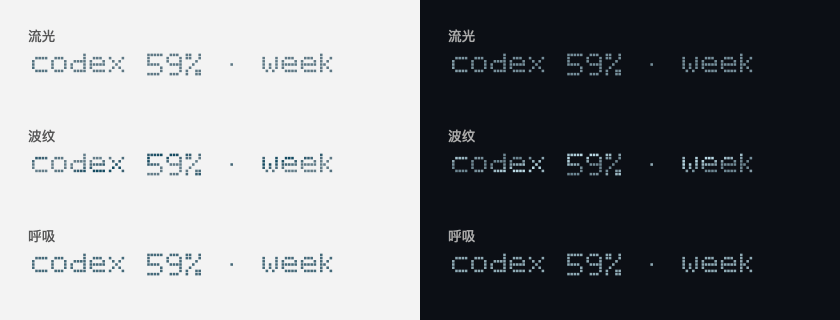
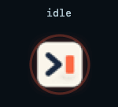

# Agent 哨站 · Agent Beacon

一个原生 macOS 菜单栏应用，显示 Codex、Cursor Agent 和 Claude Code 的本机任务状态。


空闲时菜单栏只显示订阅额度剩余百分比，不显示图标。Agent 工作时，菜单栏用固定位置的像素点显示 `loading` 和运行数量，亮度沿文字横向流动；任务完成时显示约 8 秒的 `work done!`，亮度波改为纵向扫过。动画只改变亮度，文字像素位置始终不移动。

| 浅色菜单栏 | 深色菜单栏 |
| --- | --- |
|  |  |

点击菜单栏可打开深色终端风格窗口，查看当前任务、最近一步，以及执行命令或代码片段。菜单栏配色在应用内手动选择“浅色”或“深色”，默认深色；设置会保存。

待机额度来源可选择“自动”，也可固定 Codex、Claude Code 或 Cursor。自动模式只选择能可靠读取额度的 Agent；目前支持通过本机 Codex CLI 的 app-server 查询 Codex 订阅额度。展开窗口中的 `5 小时 / week` 开关决定菜单栏显示哪个周期的剩余百分比；窗口内也列出两个周期及重置时间。应用每 60 秒刷新一次，查询失败或数据过期时显示 `usage —`，不会显示猜测的百分比。固定 Claude Code 或 Cursor 时会显示 `—`，因为它们的订阅额度暂不可读取；任务状态仍会正常显示。

额度文字使用固定像素点，提供“流光、波纹、呼吸、静态”四种显示效果。在额度区域直接切换，下面会即时预览；选择自动保存。三种动画只改变像素亮度，文字不移动。以下为示例额度的效果预览，左侧适配浅色菜单栏，右侧适配深色菜单栏：



Finder 和 Launchpad 显示同款静态应用图标；窗口顶部使用这款图标呈现动态状态：空闲时外圈呼吸，Agent 工作时环形流动，任务完成后短暂亮起。



## 下载与使用

1. 从 [Releases](https://github.com/liam13472409598-sudo/agent-beacon/releases) 下载 `AgentBeacon-app.zip`，解压并打开 `AgentBeacon.app`。应用只在菜单栏显示。
2. Codex 会话从本机 `~/.codex/sessions` 读取；额度显示还需要本机安装并登录 Codex CLI。
3. 在应用的“外观与接入”中点击“接入”，可为 Cursor Agent 和 Claude Code 安装用户级观察 Hook。接入前，应用仍可显示它们最近的本机会话，但不能可靠判断是否正在工作。

当前 App 使用本机临时签名。若 macOS 阻止打开下载的 App，可以按下方步骤从源码在自己的 Mac 上构建；面向其他 Mac 的正式分发仍需开发者证书签名与公证。

## 从源码构建

需要 macOS 14 或更新版本，以及 Apple Command Line Tools。下载仓库后运行：

```sh
./build.sh
open dist/AgentBeacon.app
```

`build.sh` 使用 SwiftUI 和 AppKit 编译 ARM64 版本，输出 `dist/AgentBeacon.app`。

## 工作方式与隐私

应用每 3 秒读取一次任务状态、每 60 秒通过本机 Codex CLI 查询一次额度，工作动画持续循环。Codex 会话直接读取本机记录；Cursor Agent 和 Claude Code 的 Hook 只写入本机 `~/Library/Application Support/AgentBeacon/events.jsonl`，内容包括时间、会话 ID、简短标题、工具名，以及最多 8 行命令或代码片段。应用自身不会上传任务数据，Hook 不会改变 Agent 的执行结果。

Claude 普通桌面聊天目前没有可用的任务事件接口；Claude Code 会话可以通过 Hook 显示实时状态。

接入程序会在修改已有 `~/.cursor/hooks.json` 或 `~/.claude/settings.json` 前，于相同目录创建带 `.agent-beacon-日期.bak` 后缀的备份。要取消接入，删除这些设置中命令包含 `agent_beacon_hook.py` 的 Hook 项目即可。
